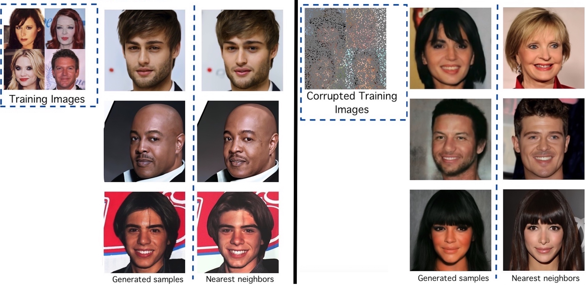

## Ambient Diffusion: Learning Clean Distributions from Corrupted Data

<center>



</center>

<u> Abstract </u>: *We present the first diffusion-based framework that can learn an unknown distribution using only highly-corrupted samples. This problem arises in scientific applications where access to uncorrupted samples is impossible or expensive to acquire. Another benefit of our approach is the ability to train generative models that do not memorize any individual training sample, since they never observe clean training data.
 Our main idea is to introduce additional measurement distortion during the diffusion process and require the model to predict the original corrupted image from the further corrupted image.  We prove that our method leads to models that learn the conditional expectation of the full uncorrupted image given this additional measurement corruption.  This holds for any corruption process that satisfies some technical conditions (and in particular includes inpainting and compressed sensing).  We train models on standard benchmarks (CelebA, CIFAR-10 and AFHQ) and show that we can learn the distribution even when all the training samples have $90\%$ of their pixels missing. We also show that when we finetune foundation models using small corrupted datasets (e.g. MRI scans with block corruptions), we learn the clean distribution without memorizing the training set.*

## Installation
The recommended way to run the code is with an Anaconda/Miniconda environment.
First, clone the repository: 

`git clone https://github.com/giannisdaras/ambient-diffusion.git`.

Then, create a new Anaconda environment and install the dependencies:

`conda env create -f environment.yml -n ambient`

You will also need to have `diffusers` installed from source. To do so, run:

`pip install git+https://github.com/huggingface/diffusers.git`

### Download pre-trained models

We provide pre-trained models for AFHQ, CelebA-HQ and CIFAR-10 trained under different corruption levels. 
The checkpoints are available through the link: [link](https://zenodo.org/record/7964925/files/checkpoints.zip?download=1).
You will neeed ~16GB of disk space for all the models.
To download from the terminal, simply run:

`wget https://zenodo.org/record/7964925/files/checkpoints.zip?download=1`

### Download datasets

You might also need to download dataset and dataset statistics for training and for FID calculation.
To do so, follow the instructions provided [here](https://github.com/NVlabs/edm#preparing-datasets).

## Calculating FID

To evaluate FID on the pre-trained models, run the following command:

```
EXPERIMENT_NAME=<experiment_name>
GPUS_PER_NODE=<number_of_gpus>
torchrun --standalone --nproc_per_node=$GPUS_PER_NODE \
    eval.py --network=<path_to_folder_that_contains_the_pkl_file OR > \
    --ref=<path_to_dataset_statistics> \
    --outdir=<out_dir> \
    --experiment_name=$EXPERIMENT_NAME \
    --seeds=0-49999 --batch=16 \
    --corruption_probability=<corruption_probability> --delta_probability=<delta_probability> --mask_full_rgb=True \
    --num_masks=1 --guidance_scale=0.0 \
    --training_options_loc=<path_to_training_options.json> \
    --num=50000 --with_wandb=False
```

## Training New Models

To train a new model on CelebA, run the following command:

```
torchrun --standalone --nproc_per_node=<GPUS_PER_NODE>  \
    train.py --outdir=<output_dir> --experiment_name=<experiment_name> --dump=200  \
    --cond=0 --arch=ddpmpp --precond=ambient --cres=1,2,2,2 --lr=2e-4 --dropout=0.1 --augment=0.15 \
    --data=<path_to_celeba_dataset> \
    --norm=2 --max_grad_norm=1.0 --mask_full_rgb=True --corruption_probability=<corruption_probability> --delta_probability=<corruption_probability> --batch=256 --max_size=30000
```


## Finetuning Foundation Models

To finetune the IF model, run the following command:

```
accelerate launch --mixed_precision="no" --multi_gpu train_text_to_image.py          --resolution=64 --center_crop --random_flip         --train_batch_size=32         --gradient_accumulation_steps=1        --max_train_steps=15000         --max_grad_norm=1.0         --learning_rate=3e-6         --lr_scheduler="constant" --lr_warmup_steps=0         --output_dir=<output_dir>        --validation_prompts "person,"         --report_to="wandb"         --corruption_probability=<corruption_probability> --delta_probability=<delta_probability>         --use_8bit_adam         --allow_tf32 --corruption_pattern="dust" --train_data_dir=<path_to_dataset>  --empty_text --max_train_samples=3000 --seed=0
```

### Generate images from the finetuned model

To generate images from the finetuned model, run:

`python if_inference.py --checkpoint_path=<path_to_state_dict.pt> --output_dir=<output_dir> --batch_size=4 --corruption_probability=<corruption_probability>`

This will generate 50000 images in the folder `<output_dir>`.

### Find nearest neighbors in the dataset

You can run the following command to find for each generated image the nearest neighbors in the dataset using DINO.

```
python find_dataset_neighbors.py --input_dir=<model_outputs> --output_dir=<output_dir> 
--data=<dataset_path> --features_path=celeba_features.npy --max_size=10000
```